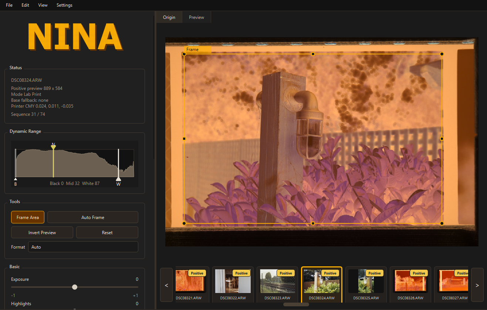
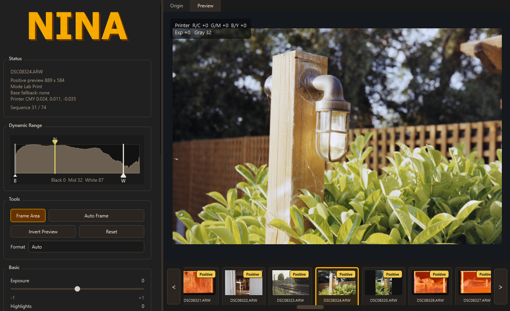

# NINA

**NINA Inverts Negative Automatically.**

NINA is a fast desktop negative conversion tool for camera-scanned film. It is inspired by the practical operating style of minilab systems such as the Frontier: load a roll, find the frame, make a clean positive, adjust quickly, and move on.

NINA is designed around camera RAW/DNG files, folder sequences, automatic frame detection, fast previewing, roll-level color correction, and lens correction for copy-camera setups.

NINA is GPLv3 licensed.

## Demo

| Camera-scanned negative | NINA positive preview |
| --- | --- |
|  |  |

## Highlights

- **Camera RAW first**: works with RAW/DNG files supported by rawpy/LibRaw.
- **Roll workflow**: open a folder, browse the bottom filmstrip, and keep each image's frame, adjustments, preview state, and completion status.
- **Auto frame detection**: detects film frames, supports format hints.
- **Automatic CMY balance**: automatic printer-style color balance with manual CMY offsets for fast correction.
- **Roll Color Analysis**: analyzes a whole roll for color bias, then applies corrections per roll and per frame.
- **Lens falloff correction**: radial correction and flat-frame profiles for copy lens vignetting.
- **Quick keyboard workflow**: adjust printer color, gray point, confirm the frame, and jump to the next image without leaving the keyboard.
- **Dust removal workflow**: generate an automatic dust/lint mask in the mask editor, then add cleanup strokes or protect image detail before export.
- **Batch export**: export completed images to TIFF, PNG, or JPEG.

## Input And Output

Primary input:

- Camera RAW files supported by rawpy/LibRaw, such as `ARW`, `DNG`, `CR2`, `CR3`, `NEF`, `RAF`, `ORF`, `RW2`.

Notes:

- Lightroom panorama files may not behave like normal camera RAW files and can be unsupported by LibRaw.
- NINA is not currently optimized as a general TIFF/JPEG negative converter. The intended workflow is camera RAW/DNG.
- Black-and-white negatives can also be inverted.

Output:

- TIFF 16-bit RGB
- TIFF 8-bit RGB
- PNG 16-bit RGB
- PNG 8-bit RGB
- JPEG 8-bit

## Quick Start

Run from source:

```powershell
pip install -r requirements.txt
python -m qnegative.app
```

Open a folder:

```text
File > Open Folder...
```

Basic workflow:

1. Open a folder of camera-scanned negatives.
2. Let NINA auto-detect the film frame and create an initial positive preview.
3. Adjust gray point, CMY balance, printer curve, and optional roll color correction.
4. Press `Space` or `Enter` to confirm the current image and move to the next.
5. Export one image or all completed images.

## Build

Windows one-folder build:

```powershell
.\scripts\build_windows.ps1 -Clean
```

The executable is written to:

```text
dist\NINA\NINA.exe
```

The current packaged build target is Windows. The codebase is Python/PySide6 and is intended to be portable, but macOS and Linux need separate platform builds and testing.

## Lens Falloff Correction

Camera scanning often has visible lens falloff. After negative inversion, this can become bright corners or uneven contrast.

NINA supports two correction modes:

- **Radial**: manual strength/radius/center correction.
- **Flat frame**: create a profile from a RAW photo of an evenly lit white panel or light table.

Recommended flat-frame workflow:

1. Keep the same lens, aperture, focus distance, and copy setup used for scanning.
2. Photograph an evenly lit white panel or light table.
3. In NINA, open Lens Correction and create a flat-frame profile from that RAW file.
4. Load the profile and adjust its strength if needed.
5. Apply it to the current image, unprocessed images, completed images, or the whole folder.

Flat-frame correction is usually the best option when the copy lens or light source produces uneven illumination.

## Roll Color Analysis

Roll Color Analysis is meant to make a whole roll feel more consistent.

It analyzes completed positive previews, estimates color bias, and then applies controlled correction per frame. This is useful when the roll is slightly too green, too blue, too warm, or inconsistent between frames.

## Printer Curve

NINA's main tone controls are in the printer curve section. `Soft Print`, `Standard Print`, and `Contrast Print` choose the base density/gradient behavior, and `Custom Printer Curve` exposes the values directly.

- **Density** shifts the print density baseline and acts like a global brightness placement in the print-curve stage.
- **Gradient** controls the print curve steepness. Higher values increase midtone contrast.
- **Highlight Bias** moves the highlight-side density response earlier or later. Positive values make paper density rise earlier in highlights, which can hold bright tones back before they clip.
- **Shadow Bias** applies the same idea on the shadow side. Positive or negative values shift how quickly the curve enters the darker end.
- **Highlight Width** and **Shadow Width** control how far each bias reaches from the tonal end toward the midtones.

The older simple highlight/shadow controls are no longer part of the main Basic panel; their role is handled by these printer-curve bias controls.

## Dust Removal

Dust removal is mask based. Open `Edit Mask`, generate the automatic mask, inspect the overlay, then use manual brushes to add missed dust/lint or protect image detail that should not be repaired. Export reuses the saved mask and does not rerun automatic mask generation for that image.

Available model styles:

- **Lint 1.0 Safe**: conservative default model. It has fewer false positives and is safer around real image edges, but can miss parts of long or large fibers.
- **Lint 2.0 Candidate**: more aggressive lint model for long, sharp, and curly fibers. It can cover difficult lint better, but may respond more strongly to line-like image detail.
- **Dust 1.0 Recall**: higher-recall dust model. It is more willing to flag dust and lint, but can also flag texture more often.

## Keyboard Shortcuts

Coarse printer-color shortcuts use a step of `20`. Hold `Shift` for a fine step of `5`. Gray point uses a step of `5`, or `1` with `Shift`.

| Shortcut | Action |
| --- | --- |
| `Left` / `Right` | Move to previous / next file in the filmstrip. |
| `Space` / `Enter` | Confirm current image and move to the next file. |
| `Tab` | Toggle between `Origin` and `Preview`. |
| `I` | Render / refresh positive preview. |
| `K` | Auto-detect frame. |
| `Q` / `A` | Move printer balance toward yellow / blue. |
| `W` / `S` | Move printer balance toward magenta / green. |
| `E` / `D` | Move printer balance toward cyan / red. |
| `R` / `F` | Move gray point brighter / darker. |
| `Ctrl+Z` / `Ctrl+Y` | Undo / redo adjustments. |

Preview right-click menu:

- Flip horizontal
- Flip vertical
- Rotate 90 clockwise
- Rotate 90 counterclockwise

## Settings And Sessions

Application preferences are saved as JSON:

```text
%LOCALAPPDATA%\NINA\NINA\settings.json
```

These include GPU preview, auto frame behavior, pre-invert range, safe crop, analysis boundary, autosave, and default export directory.

Per-folder roll state is saved in:

```text
.nina/roll_session.json
```

The roll session stores each image's frame area, adjustments, automatic CMY offsets, preview orientation, completion state, and roll color data.

## Processing Outline

The default conversion path is intentionally simple at the user level:

```text
camera RAW
-> frame crop / warp
-> optional lens falloff correction
-> Lab Print conversion
-> auto levels and CMY balance
-> print curve and color controls
-> optional saved dust mask inpaint
-> preview or export
```

More detailed implementation notes are in [qnegative/core/PIPELINE.md](qnegative/core/PIPELINE.md).

## Project Status

NINA is usable in current state, but still actively evolving.

Current priorities:

- Better automatic frame detection.
- Better lens profiles.
- Camera stitching / panorama workflow research.
- Better dust/lint models and mask editing ergonomics.

## Dependencies

Core runtime:

- PySide6
- rawpy / LibRaw
- NumPy
- OpenCV
- tifffile

Optional ML/ranker development dependencies are listed in `requirements-ml.txt`.

## License

NINA is released under the GNU General Public License v3. See [LICENSE](LICENSE).
